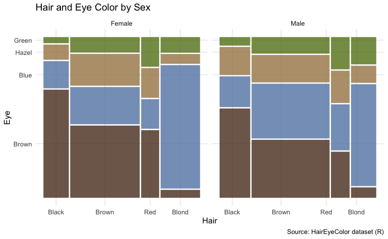
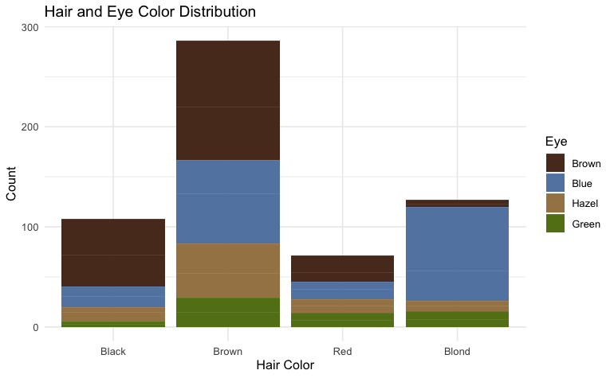
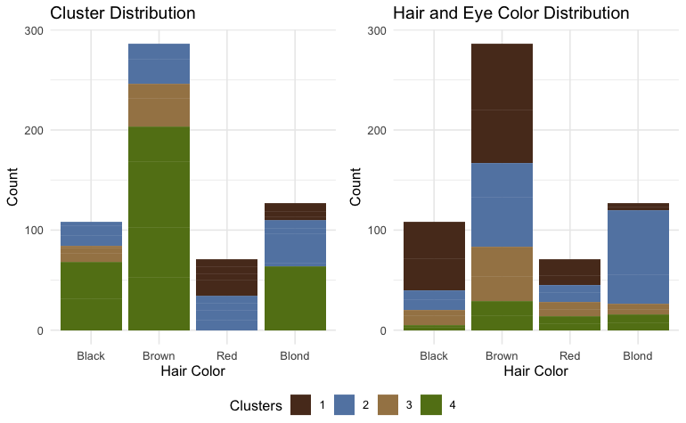
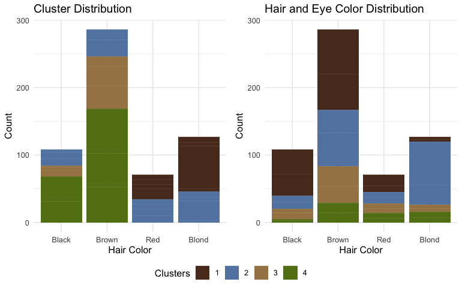
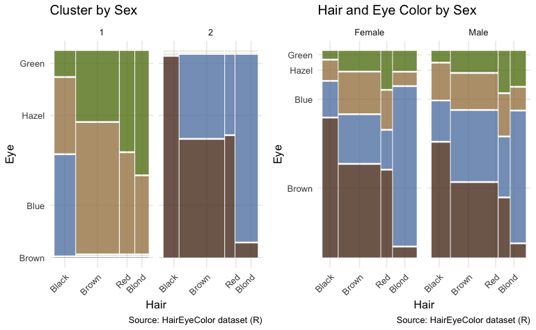
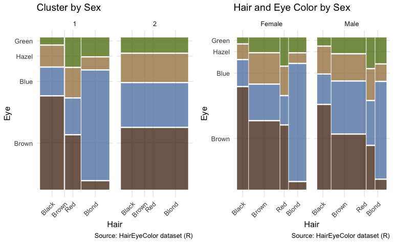

```{r setup, include = FALSE}
knitr::opts_chunk$set(
  collapse = TRUE,
  comment = "#>"
)
```

## Packages


```{r eval=FALSE, message=FALSE, warning=FALSE, include=TRUE}
#suggested packages
library(lloydr)
library(dplyr)
library(ggplot2)
library(ggpubr)
library(ggmosaic)
```


## Hair and Eye Colour Dataset

The majority of use-cases and examples for this package include datasets derived from random data generators using built in random distributions, such as `rnorm()`. This use-case will employ the `HairEyeColor` dataset provided in the R `datasets` package [@datasets]. As this is a toy-example, meant to test and explore the capabilities of the `lloydr` package, stringent analytical methodologies will be ignored in favour of a more casual approach that simply tests features and explores output. 

### Use this as a springboard to dive deeper and explore further! 

**please note:** Plots used in this report which have been created with `ggplot2` have been reproduced and included here as images. All other code is included here. For more, see help files for `calculate_clusters`

## Load and inspect dataset

```{r}
library(lloydr)

data("HairEyeColor")
summary(HairEyeColor)
dataset <- as.data.frame(HairEyeColor)
summary(dataset)
```

## Clustering Mixed Data

The common approach, when clustering, is to visualise cluster centres on a scatterplot, in order to see how well the given approach is working, or to get a visual sense of the convergence. In this example, our data consists of categories and their frequencies. If we plot these, there is no clear way to plot or consider clusters:

```{r echo=FALSE, fig.height=3, fig.width=6, message=FALSE, warning=FALSE}
plot(dataset)
```


Above, we can see how these measures fit neatly into groups, but we don't seem to have an obvious method for looking at cluster points.

Instead, we can check our clustering by assignment. We'll try to visualise our clusters by colouring them according to eye-colour, and compare these against the distributions of Hair / Eye colour. First, we'll plot the distributions of hair / eye colour, first for pooled data, then by sex. These will show the proportions of eye colour by hair-type: 

### Plot Grouped and Separated (by sex) Data

 
 

Next, we'll plot these by frequencies, to see the numbers of observations in each category of hair, coloured by eye: 

### Frequency Distributions 

 

Okay, great. Now we can run the `calculate_clusters` function to get cluster assignment, and use those to compare by hair / eye, using the plot above.  

# Clustering 

Let's explore some clusters. Since there's 4 groups, I'll create a cluster of 4 using Euclidean distance:

```{r}
set.seed(1234)
clust1 <- calculate_clusters(dataset,4, distance = "euclidean")
print(clust1)
```
Let's plot this and compare cluster assignment to eye colour: 

 

Okay, this doesn't look right, but it's not terrible. For black hair, we could change the colour assignments and see a roughly similar proportion of eye colour. Brown hair is way off. As is red. Blond isn't right either, but the small amount of brown suggests that something is working.  

Next, let's try the other cluster distance methods, starting with *manhattan*:

```{r}
set.seed(1234)
clust2 <- calculate_clusters(dataset,4, distance = "manhattan")
print(clust2)
```

 


This one is worse. Let's have a look at *cosine*: 

```{r}
set.seed(1234)
clust3 <- calculate_clusters(dataset,4, distance = "cosine")
print(clust3)

```

 

This one isn't too different from *euclidean*. If we changed the labels in black hair, that column might look okay. Also, notice that blond has a small sliver of brown eyes, which is also on the right track. 

Last, let's look at *gower*: 

```{r}
set.seed(12)
clust4 <- calculate_clusters(dataset,4, distance = "gower", max.iter = 1000)
print(clust4)
```

 

This one isn't perfect either, but it's on the right track. The size of the brown-eyes levels for each hair colour is closer to the observed colours. Blue eyes are also roughly consistent with blond and brown hair. Green eyes are absent in all but one hair colour, so that's an example of where some inconsistencies apply. 
## Compare Clusters 

We'll use `compare_clusters` to compare these outcomes and check the measured results with our visual references above: 


```{r}
set.seed(1234)
compare <- compare_clusters(dataset, 4, max.iter = 10000)
print(compare)
```

The worst performer is the *manhattan* distance, followed by *euclidean*. This isn't too surprising. Interestingly, *cosine* appeared to perform similarly to *euclidean* but has a higher Dunn index. And finally, *gower* performs the best of the lot, but far and away, takes the longest to converge. This is an example of a trade-off between cost and accuracy. 

# Comparison 2

Finally, as a last test, let's set the cluster number to 2, and see how we go when we try to divide by sex. We have to remove the column, `Sex`, first because otherwise we'll get a perfect result, and that's no fun. Let's look at *manhattan* compared to *gower*: 

## Manhattan with 2 clusters

```{r}
set.seed(123)
data_nosex <- dataset[,-3]
clust5 <- calculate_clusters(data_nosex,2, distance = "manhattan", max.iter = 1000)
print(clust5)
```

 

```{r}
set.seed(123)
data_nosex <- dataset[,-3]
clust6 <- calculate_clusters(data_nosex,2, distance = "gower", max.iter = 1000)
print(clust6)
```

 


Okay, wow. Neither of them did spectacularly well, but clearly *gower* distance is on the right track. 


# References 


<!-- Old (delete?) -->

<!-- And finally, we'll make a function to calculate the cluster scores: -->

<!-- ```{r} -->
<!-- # Function to calculate accuracy and ROC curve from a clustering result -->
<!-- evaluate_clustering <- function(cluster_object) { -->

<!--   clusts <- "cluster" -->
<!--   data <- dataset -->

<!--   # Extract labels -->
<!--   cluster_labels <- cluster_object[[clusts]] -->

<!--   # Append dataset with cluster labels -->
<!--   data[[clusts]] <- cluster_labels -->

<!--   # Modify clusters in labeled_data (1 -> 0, 2 -> 1) -->
<!--   labeled_data$clusters <- ifelse(labeled_data[[clusts]] == 2, 1, 0)  -->

<!--   # Binary encoding of income variable (small = 1, large = 0) -->
<!--   binary_income <- ifelse(labeled_data[[income_var]] == "small", 1, 0) -->

<!--   # Calculate accuracy -->
<!--   accuracy <- sum(binary_income == labeled_data[[clusts]]) / nrow(labeled_data) -->
<!--   print(paste("Accuracy:", accuracy)) -->

<!--   # Calculate ROC curve and AUC -->
<!--   #library(pROC) -->
<!--   roc_curve <- roc(binary_income, as.numeric(labeled_data[[clusts]])) -->

<!--   # Plot ROC curve -->
<!--   plot(roc_curve, main = "ROC Curve for Clustering") -->

<!--   # Calculate AUC -->
<!--   auc_value <- auc(roc_curve) -->
<!--   print(paste("AUC:", auc_value)) -->

<!--   # Return the evaluation metrics as a list -->
<!--   list(accuracy = accuracy, -->
<!--               auc = auc_value, -->
<!--               roc_curve = roc_curve) -->
<!--   return(list(accuracy = accuracy, -->
<!--               auc = auc_value, -->
<!--               roc_curve = roc_curve)) -->
<!-- } -->

<!-- ``` -->

